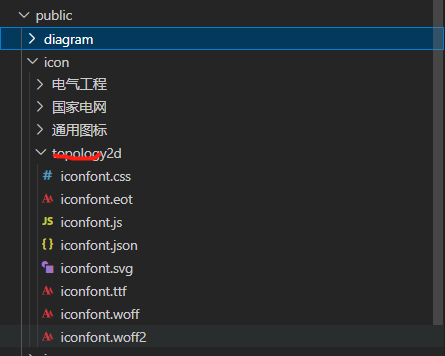
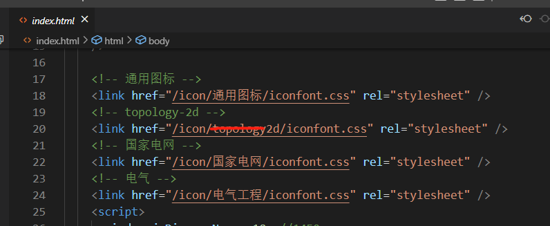
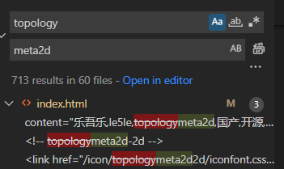
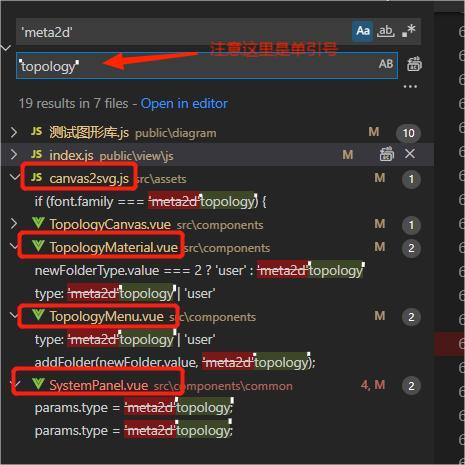

# 升级变动

## 核心库

- **新版本，dirtyPenRect 重命名为updatePenRect**
- **新版本，render规则优化，即topology.render(Infinity); 修改为 topology.render();**
- **版本 \[1.1.34,1.1.39\] 之间，节点事件中使用到了codition字段，我们发现这样不太合理，请直接升级到1.1.39版本**

- **1.2.1版本及以后，window更改为globalThis，事件行为中枚举变量名WindowFn重命名为 GlobalFn**

- **1.2.2版本以后，_setValue方式将逐渐不再使用（但任然兼容），[setValue](./../api/core.md#setvalue)引入了doEvent参数替代**

## 图形库

- **@topology/form-diagram图形库（对应官网表单）中，table升级为table2，table不再维护**

## 产品重命名

核心库@topology/core 1.2.16版本以后,我们对产品进行重命名，topology改名为meta2d，我们认为：__由一个个绘图元素和一个个元数据组成的实时响应交互的可视化产品。__更符合我们对产品的定义。

### 购买编辑器源码版未二开的客户

  如果你并没有进行二次开发，但是希望跟我们官网保持同步，建议直接拉取最新的代码。
   
   

### 购买编辑器源码并进行二开的客户

1. 更改文件名
  
  如下图所示：

  
  
  

2. 全局替换

 如图所示，利用代码编辑器全局替换功能进行代码替换，以Vscode为例，如图，注意勾选'Aa'大小写筛选。
 
  
  
   

3. 后端老接口保持不变

由于老版后端接口保持不变，因此需要将部分代码替换回去（如果是自己二开实现后端接口，并且接口地址不包含topology，请忽略这个步骤）
  
如下图所示，替换框选部分：

 

  

4. 更改核心库版本

5. 重新安装依赖

删掉node_modules和yarn.lock文件，重新安装依赖。

6. 购买js图形库的用户
   
 直接联系我们的商务，获取最新版本的js图形库，替换即可。

### 未购买编辑器源码

  参考2部分内容进行更改
